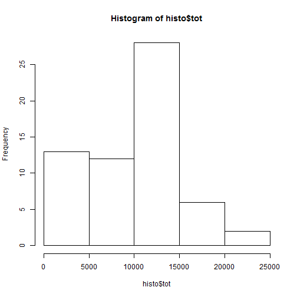
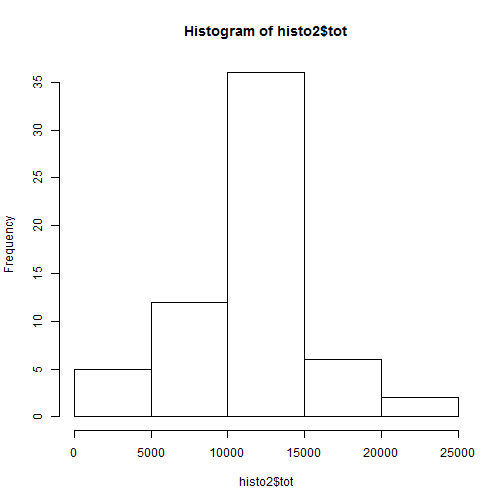
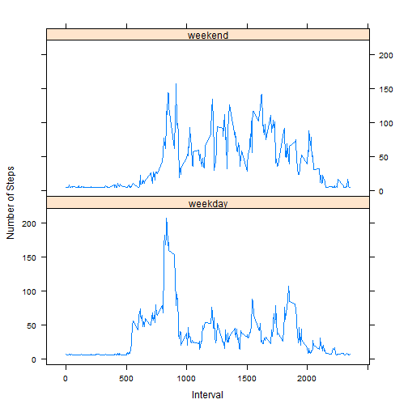

Load the dataset
The dataset was found at https://d396qusza40orc.cloudfront.net/repdata%2Fdata%2Factivity.zip and downloaded and unzipped directly to the working directory. The following code was used to open the dataset


```r
dat <- read.csv("activity.csv")
```

**What is mean total number of steps taken per day?**

Missing values in the dataset were ignored.

1. Calculate the total number of steps taken per day


```r
library(plyr)
histo <- ddply(dat, .(date), summarize, tot=sum(steps, na.rm=TRUE))
```

2. Make a histogram of the total number of steps taken each day


```r
hist(histo$tot)
```

 

3. Calculate and report the mean and median of the total number of steps taken per day


```r
histomean <- mean(histo$tot, na.rm=TRUE)
histomedian <- median(histo$tot, na.rm=TRUE)
histomean
```

```
## [1] 9354.23
```

```r
histomedian
```

```
## [1] 10395
```

**What is the average daily activity pattern?**

1. Make a time series plot (i.e. type = "l") of the 5-minute interval (x-axis) and the average number of steps taken, averaged across all days (y-axis)


```r
library(plyr)
timeo <- ddply(dat, .(interval), summarize, tot=mean(steps, na.rm=TRUE))
plot(timeo$interval, timeo$tot, type="l", xlab="Interval", ylab="Average Steps")
```

 

2. Which 5-minute interval, on average across all the days in the dataset, contains the maximum number of steps?


```r
maxo <- max(timeo$tot, na.rm=TRUE)
maxinterval <- subset(timeo, tot==maxo)
maxinterval
```

```
##     interval      tot
## 104      835 206.1698
```

**Imputing missing values**

1. Calculate and report the total number of missing values in the dataset (i.e. the total number of rows with NAs)


```r
sum(is.na(dat$interval))
```

```
## [1] 0
```

```r
sum(is.na(dat$date))
```

```
## [1] 0
```

```r
sum(is.na(dat$steps))
```

```
## [1] 2304
```

2. Devise a strategy for filling in all of the missing values in the dataset. The strategy does not need to be sophisticated. For example, you could use the mean/median for that day, or the mean for that 5-minute interval, etc.

For this part, I choose to take the mean of the all the known steps in the dataset and use that number to replace the NAs.

```r
dat2 <- dat
dat2$steps <- replace(dat2$steps, is.na(dat2$steps), mean(dat$steps, na.rm=TRUE))
```

3. Create a new dataset that is equal to the original dataset but with the missing data filled in.


```r
library(plyr)
histo2 <- ddply(dat2, .(date), summarize, tot=sum(steps, na.rm=TRUE))
```

4. Make a histogram of the total number of steps taken each day and Calculate and report the mean and median total number of steps taken per day. Do these values differ from the estimates from the first part of the assignment? What is the impact of imputing missing data on the estimates of the total daily number of steps?


```r
hist(histo2$tot)
```

 

```r
histo2mean <- mean(histo2$tot, na.rm=TRUE)
histo2median <- median(histo2$tot, na.rm=TRUE)
histo2mean
```

```
## [1] 10766.19
```

```r
histo2median
```

```
## [1] 10766.19
```

The histogram and the mean and median differ, but only slightly, from the values calculated in when using missing data.The impact can be quite dramatic or tiny depending on the numbers used. In this case, the impact was relatively tiny.

**Are there differences in activity patterns between weekdays and weekends?**

1. Create a new factor variable in the dataset with two levels – “weekday” and “weekend” indicating whether a given date is a weekday or weekend day.


```r
dat2$date <- as.Date(dat2$date, "%Y-%m-%d")

dat2$dayofweek <- weekdays(dat2$date)
dat2$dayofweek[dat2$dayofweek== "Monday"] <- "weekday"
dat2$dayofweek[dat2$dayofweek== "Tuesday"] <- "weekday"
dat2$dayofweek[dat2$dayofweek== "Wednesday"] <- "weekday"
dat2$dayofweek[dat2$dayofweek== "Thursday"] <- "weekday"
dat2$dayofweek[dat2$dayofweek== "Friday"] <- "weekday"
dat2$dayofweek[dat2$dayofweek== "Saturday"] <- "weekend"
dat2$dayofweek[dat2$dayofweek== "Sunday"] <- "weekend"
```

2. Make a panel plot containing a time series plot (i.e. type = "l") of the 5-minute interval (x-axis) and the average number of steps taken, averaged across all weekday days or weekend days (y-axis). 


```r
library(plyr)
timeo2 <- ddply(dat2, c("dayofweek", "interval"), summarize, tot=mean(steps, na.rm=TRUE))

library(lattice)
xyplot(tot~interval|dayofweek, data=timeo2, type="l", xlab="Interval", ylab="Number of Steps", layout=c(1,2))
```

 
